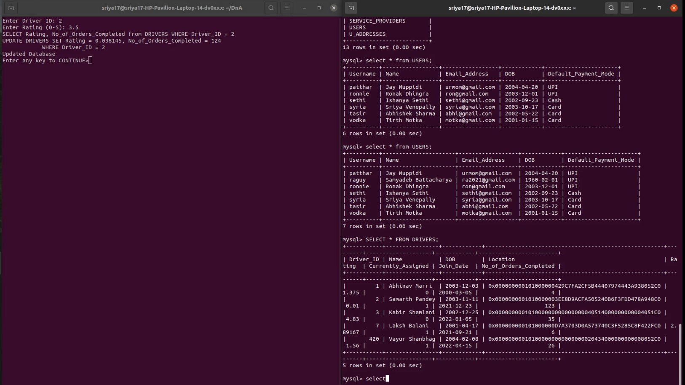

# DNA Project



This repository contains our DNA (Data and Applications) group project made in my second year (November 2022).

The project is a command line interface for a food delivery service that models users, resturants, orders, drivers, coupons, dishes, and ratings among many others. It is written in Python and uses SQLite3 as the database.

# Project Phase 4
## Jay Muppidi, Sriya Venepally, Ronak Dhingra
## 2021101035, 2021101084, 2021101091

> ### Running the file:  
```
$ python3 boilerPlate.py
```  

> ### List of Commands:

1. Insert: Entry of a new `USER` in the database
2. Update: Update the `Rating` of a `DRIVER` after the order is completed and increment the `No_of_Orders_Completed`
3. Delete: Remove a `USER'S` liked `SERVICE_PROVIDER` tuple from `LIKES` 
4. Select: List all `DRIVERS` and `SERVICE_PROVIDERS` whose rating is less than 2
5. Project: List the `Total Amount` of all `BILLS` with Mode of payment as UPI
6. Aggregate: Find a `DRIVER` with the MAX (highest) `Rating`
7. Search: Search for entries in `FOOD`
8. Analysis: Find all `SERVICE_PROVIDERS` which qualify to be tasted by Jay to win  `Jay's Seal of Approval`
9. Logout
